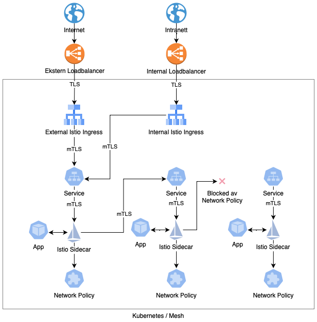

# Sikkerhet

SKIP er bygget etter prinsippet om innebygget sikkerhet, slik at det blir lett å
gjøre rett. Standardoppførselen skal i utgangspunktet være sikker, med mulighet
for produktteamene å overstyre der det gir mening for deres applikasjon. Dette
er kort fortalt hvordan SKIP balanserer behovet for sikkerhet med autonomi.

Et eksempel på dette er prinsippet om Zero Trust i nettverkslaget. All trafikk
på Kubernetes er i utgangspunktet stengt, en pod kan ikke snakke med en hvilken
som helst annen. Kun om begge tjenestene åpner for at de kan snakke med
hverandre kan trafikken flyte mellom dem. Dette gjør produktteamene selv ved
å sette `accessPolicy` i sitt Skiperator-manifest.

All trafikk mellom podder i Kubernetes er kryptert med mTLS helt automatisk. Det
eneste man trenger å gjøre er å sende spørringer til en annen pod, så krypterer
Service Meshet koblingen automatisk.

Dersom man trenger å eksponere applikasjonen sin til omverdenen kan man
konfigurere et endepunkt som applikasjonen skal eksponeres på. Når dette er
konfigurert får man utstedt et gyldig sertifikat som gjør at all trafikk
krypteres med HTTPS helt automatisk. Dette sertifikatet fornyes også automatisk.

Dette og mye mer fører til at det er lett å gjøre rett på SKIP.
