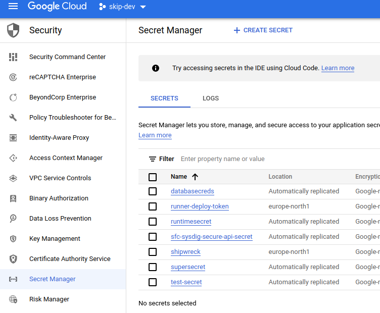
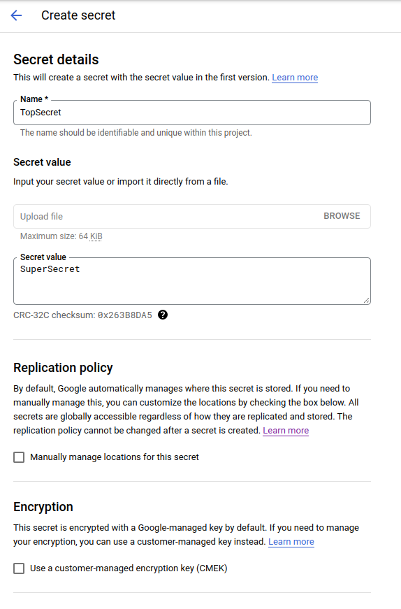
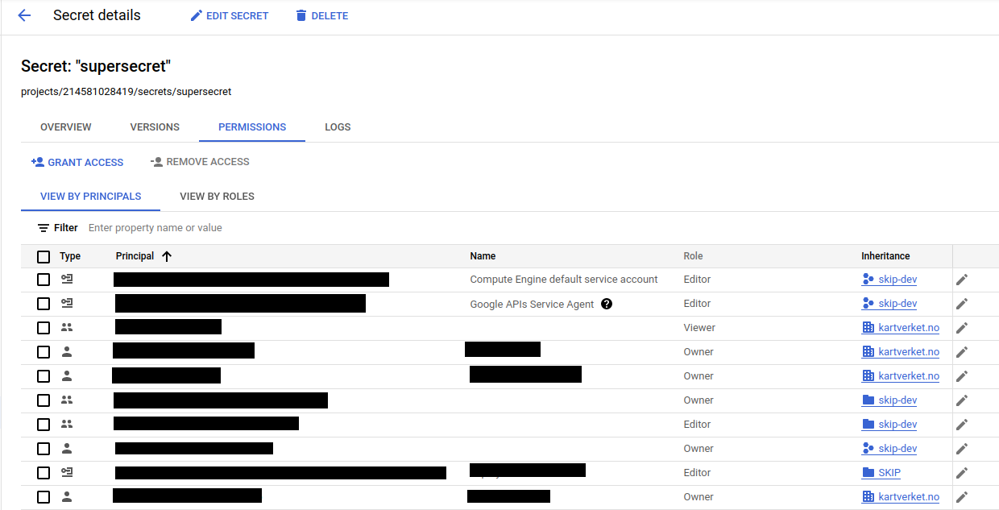

# Oppsett og bruk av Google Secret Manager

Google Secret Manager (GSM) er et system for å sikkert lagre nøkler, passord, sertfikater og andre sensitive data i GCP. GSM er det foretrukne stedet å lagre hemmeligheter på SKIP og Vault vil på sikt fases ut til fordel for dette.

Det er mange fordeler med GSM:

- Tilgangsstyring er enkelt satt opp ved hjelp av GCP IAM
- All aksessering av hemmelighetene blir logget og kan ettergås
- Hemmelighetene blir kryptert i transit og at rest
- Veldig stabilt og fullt driftet av GCP
- Praktisk talt gratis
- Kan administreres med [Terraform](https://registry.terraform.io/providers/hashicorp/google/latest/docs/resources/secret_manager_secret)
- Man kan bruke GitHub cloud runners som fører til raskere bygg med mer [pre-installed sofware](https://github.com/actions/runner-images/blob/main/images/linux/Ubuntu2204-Readme.md)
- Tilgjengelig fra Kubernetes via [Hente hemmeligheter fra hemmelighetshvelv](../argo-cd/hente_hemmeligheter_fra_hemmelighetshvelv)

## Hvordan komme i gang?

GSM fungerer ganske likt Vault. Vault har noe mer funksjonalitet for avansert bruk, men vi bruker for det meste som et KV secret store. For å bruke GSM må det opprettes en secret, og denne secreten må tilgangsstyres.

### Hvordan opprette Secret

- Velg **Security** under navigasjonsmenyen (de tre strekene ved Google Cloud i høyre hjørne).
- Velg **Secret Manager** i venstre kolonne.
- Hvis API’et ikke er skrudd på, skru på API’et ved å trykke “Enable”
- Trykk på **+** **CREATE SECRET**

**Name**, og **Value** kan tenkes på som et Key/Value par. Resten av valgene trenger man ikke gjøre noe med med mindre man har spesielle behov. Noen felter man kan merke seg er:

**Replication Policy:** Dette er hvor hemmeligheten lagres. Det kan være en fordel å lagre hemmeligheter i flere datacenter for redundans, vi har vanligvis holdt oss i europe-north1.

**Encryption:** Om det er spesielle behov for å administrere krypteringsnøkkel selv er det også en mulighet. Dette må produktteamene ta ansvar for selv. SKIP teamet administrerer ikke krypteringsnøkler.

### Tilgangsstyring

Når en secret er opprettet, kan man klikke seg inn på den, og velge **PERMISSIONS** fanen. Man får da opp hvem som har tilgang til denne secreten, og hvilke rettigheter de har.

I de fleste tilfeller vil man bruke External Secret til å hente ut disse hemmelighetene. Det kan gjøres ved å opprette ExternalSecrets-ressurser i Kubernetes som henter ned hemmeligheten til en Kubernetes Secret. Det står mer om dette inkludert tilgangsstyring på [Hente hemmeligheter fra hemmelighetshvelv](../09-argo-cd/04-hente-hemmeligheter-fra-hemmelighetsvelv.md) .
