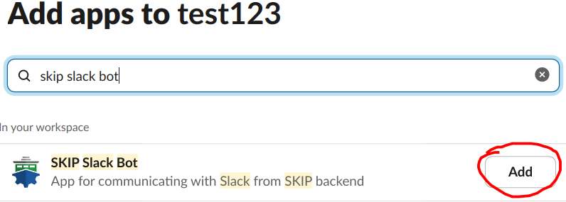

# Kostnadsoversikt og alarmer

## Kostnadsoversikt
SKIP har laget et Grafana dashboard som kan brukes til å holde en løpende oversikt over kostnader.
Dashboardet viser kostnader fordelt på prosjekter og tjenester, og gir en oversikt gruppert på divisjoner eller teams.

Dashboardet kan man finne [her](https://monitoring.kartverket.cloud/d/ee3q31rt3uosgd/gcp-cost?orgId=1&from=now-7d&to=now&timezone=browser&var-division=eiendom&var-team=$__all).

> **Merk:** GCP Cost dashboardet vil vise små forskjeller fra GCP Budgets, dette skyldes start tiden på intervallet.   
> Dataen i dashboardet kan også oppdatere seg litt tregere. Se på dashboardet som en pekepinn, mens GCP Budgets er fasiten.
## Alarmer
For å unngå overraskelser i form av høye kostnader, er det viktig å sette opp alarmer. Alarmer kan settes opp for å varsle om kostnader som overstiger en viss grense, eller for å varsle om kostnader som øker raskt.

Vi anbefaler på det sterkeste at alarmer blir satt når dere tar i bruk tjenester i Google Cloud. 
Dette kan gjøres i [cost-alerts](https://github.com/kartverket/cost-alerts) repoet på Github.

Kostnadsalarmer i GCP heter 'budgets', så herfra referes kostnadsalarmer som budsjett.

> Standard intervall på budsjetter er månedlig. Det vil si fra den første til den siste dagen i måneden.
### Hvordan sette opp et budsjett
[cost-alerts](https://github.com/kartverket/cost-alerts) fungerer på mange måter likt som [grafana-alerts](https://github.com/kartverket/grafana-alerts) repoet.
Dersom dere skal opprette deres første budsjett, så opprett en PR mot cost-alerts repoet hvor dere gjør følgende:
- Opprett en fil med navnet på teamet i `teams` mappen, f.eks `teams/mitt-team.tf` 
- Legg til en linje i `CODEOWNERS`-filen, med følgende format: `teams/mitt-team.tf @kartverket/mitt-team`

I `teams/mitt-team.tf`-filen så kan man opprette et budsjett slik:

```hcl 
module "mitt_team_gcp_budget" {
  source = "./modules/gcp-budget"
  budgets = [
    {
      name          = "produkt"
      project_ids   = ["project-dev-1", "project-prod-2"]
      budget_amount = 500                      
      alert_exceeded_threshold = [0.75, 1.0] 
      alert_forecast_threshold = [1.0]         
    }
  ]
  slack_channel_name           = "#your-teams-slack-channel"
  email_address                = "alerts@example.com"
}
```

Forklaringer på variabler:
- `name`: Navnet på budsjettet, dere velger selv
- `project_ids`: Prosjektene som budsjettet skal gjelde for. En prosjekt ID finner dere på 'forsiden' til prosjektet på [GCP](https://console.cloud.google.com).
- `budget_amount`: Beløpet som budsjettet skal varsle om. Dette er i EURO.
- `alert_exceeded_threshold`: Dette er en liste med tall som sier hvor mye av budsjettet som skal overskrides før det varsles. Tallene er i desimalformat av prosent, altså 0.75 = 75%. Valgfritt, standard er 0.75 og 1.0.
- `alert_forecast_threshold`: Samme som over, men her varsles det om forventet bruk. Valgfritt, standard er 1.0.
- `slack_channel_name`: Navnet på slack-kanalen som varsler skal sendes til, husk å inkluder # foran navnet.
- `email_address`: E-postadressen som varsler skal sendes til.

README i cost-alerts repoet inneholder mer utfyllende informasjon om bruk av modulen.
### Slack
Dersom dere har lagt inn at det skal varsles til slack, så må dere invitere `SKIP Slack Bot` til kanalen det skal varsles til.

1. Gå til slack kanalen og trykk på medlemslisten oppe til høyre i vinduet

2. Trykk på `Integrations` i menyen som kommer opp, velg deretter `Add an App`

3. Søk etter `SKIP Slack Bot` og trykk på `Add`
