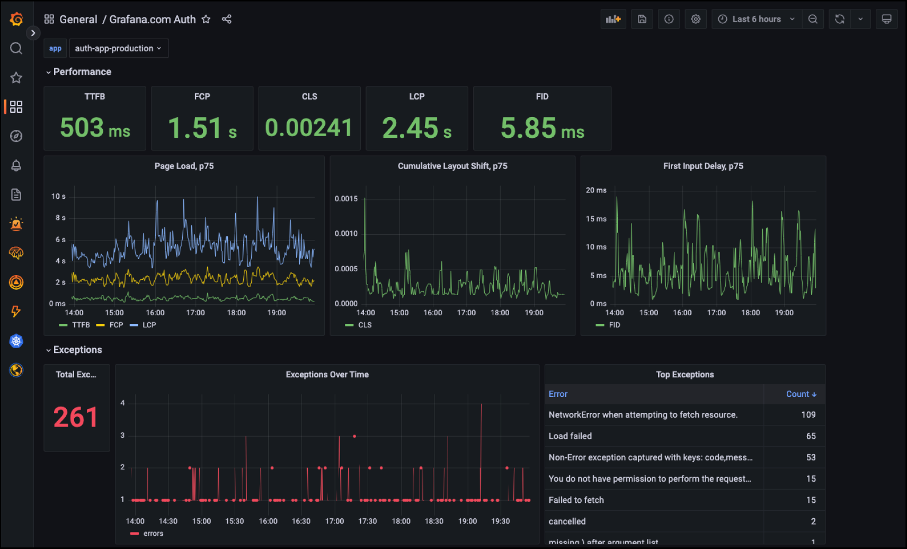

# Real User Monitoring with Faro



Detecting loading times of pages and user behavior within their browsers can often be tricky, as there are no logs or metrics generated to inspect. [Grafana Faro](https://grafana.com/oss/faro/) solves this by enabling you to add a JavaScript SDK to your frontend which sends events over HTTP to a receiver that ingests the data into Grafana. This way you are able to observe real user behavior metrics in real time using Grafana and set alerts on them as you usually would with Grafana Alerting.

There are multiple types of events that are supported by Faro:

- Events like Time To First Byte and First Contentful Paint can help with debugging slow frontend pages
- Exceptions are collected and sent so that you have a complete catalogue of any exceptions that have been thrown in the frontend of your app. Source maps are used to map line numbers back to source code
- Page visits are counted so that you can see which pages are visited by users.
- Metadata like browser type enables you to see which browsers are in use and which you don’t need to support anymore

You may have heard of similar services like [Sentry.io](http://sentry.io/) . Faro is not to be confused with an analytics service,and it is recommended to have a separate instance for user insights like Google Analytics or Posthog. An analytics service can tell you more about user behaviour, while services like Faro and Sentry are more intended for monitoring and debugging.

## Getting started

Setting up Faro requires two steps which are explained below:

1. Installing the SDK
2. Configuring the SDK

It will also be useful to start by reading the [Faro quick start guide](https://github.com/grafana/faro-web-sdk/blob/main/docs/sources/tutorials/quick-start-browser.md#install-grafana-faro-web-sdk) . See also the [README](https://github.com/grafana/faro-web-sdk/blob/main/README.md) of the Faro GitHub page for more links to relevant documentation.

### Installing the SDK

If you use React this is done by running one of the following commands:

```bash
# If you use npm
npm i -S @grafana/faro-web-sdk

# If you use Yarn
yarn add @grafana/faro-web-sdk
```

### Configuring the SDK

Import and configure the following options in your app’s entrypoint (main.js or similar).

```js
import { initializeFaro } from "@grafana/faro-react";

initializeFaro({
  app: {
    name: "my_app_name",
    environment: getCurrentEnvironment(),
  },
  url: "https://faro.atgcp1-prod.kartverket.cloud/collect",
});
```

### List of valid options for `app`

|             | **Type**    | **Description**                                                        | **Required?** |
| ----------- | ----------- | ---------------------------------------------------------------------- | ------------- |
| name        | string      | The name of the application as it will appear on dashboards in Grafana | Yes           |
| environment | “localhost” &vert; “dev” &vert; “test” &vert; “prod” | The environment the frontend is currently running in. This is used to filter data in Grafana dashboards | Yes |

### Configuring the SDK with React Router integration

Grafana Faro supports integration with React Router. This gives you events for page navigation and re-renders. See the [Faro docs](https://github.com/grafana/faro-web-sdk/blob/main/packages/react/README.md) for more information on this.

## Showing the data

When the metrics have started to be gathered, they will be visible in a dedicated Grafana Faro dashboard. This dashboard can be found [here](https://monitoring.kartverket.cloud/d/CiroMopVz/grafana-faro-frontend-monitoring) .

It is also possible to search for data in the [explore view](https://monitoring.kartverket.cloud/explore) . Useful labels to search for are:

- `faro_app_name`
- `kind`
- `env`

## Privacy concerns

:::note
It is up to you and your team to consider the how to use Faro with personal information as outlined in your IP and DPIA
:::

When we send data to Faro, it is mostly metrics that don’t contain any [PII](https://www.investopedia.com/terms/p/personally-identifiable-information-pii.asp) . It is possible to include PII like name, IP or anything that is accessible from JavaScript in the SDK, but this is not done by default and requres calling the `setUser` function on the SDK.

A session ID is sent in to enable de-duplicating events like navigation between pages and ranking top users. This is a randomly generated string and is stored in the user’s browser SessionStorage. Note that even though this is not a cookie, this means a “cookie banner” is required as per the EU’s [ePrivacy directive](https://en.wikipedia.org/wiki/EPrivacy_Directive#Cookies) .

As `SessionInstrumentation` is [included by default](https://github.com/grafana/faro-web-sdk/blob/28f2d0c6c3032ce56876045c5a92256f5f798605/packages/web-sdk/src/config/getWebInstrumentations.ts#L18) in the web instrumentation of the JavaScript SDK, disabling it requires invoking the SDK with `instrumentations` set and omitting the `SessionInstrumentation` function.

Data is stored on SKIP’s `atgcp1-prod` cluster, which stores data in Google Cloud Storage europe-north1 region. This region is located in Finland, and is thus within EU. This means no data leaves the EU’s borders which means the storage of the data is compliant with GDPR.

## Rate limiting

A rate limit for requests is implemented and is currently set to `50` requests per second. This is shared between all users of Faro, so it’s possible that we eventually reach the limit. Contact SKIP if you start getting queries rejected with `HTTP 429 Too Many Requests` .

The rate limiting algorighm is a token bucket algorithm, where a bucket has a maximum capacity for up to burst_size requests and refills at a rate of rate per second.

Each HTTP request drains the capacity of the bucket by one. Once the bucket is empty, HTTP requests are rejected with an HTTP 429 Too Many Requests status code until the bucket has more available capacity.

## Tracing

Faro supports [tracing](https://grafana.com/docs/grafana-cloud/monitor-applications/frontend-observability/instrument/tracing-instrumentation/) of HTTP requests, but this is not currently implemented in the collector on SKIP. Contact SKIP if you want this!
