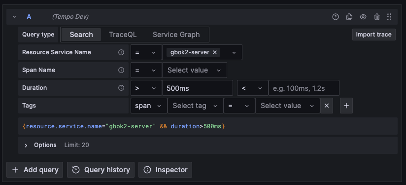

# Distributed tracing with Tempo

## What is distributed tracing?

In complex (and distributed) systems there are at any time many ongoing parallel processes. Some of these are interlinked or trigger each other. In order to find out which operations that originate from the same request, it is common in many systems to have a so-called Trace ID. With modern distributed tracing this is standardized, and in addition sub-operations (spans) per Trace ID are also supported. When you use a standardized setup to trace applications you also gain access to a large and exciting toolbox.

Further reading:

- [OpenTelemetry](https://opentelemetry.io/)
- [Zipkin](https://zipkin.io/) (interesting from a historical perspective)
- [A general guide to getting started with distributed tracing](https://www.honeycomb.io/getting-started/getting-started-distributed-tracing)

## What does SKIP offer?

As part of our implementation of the LGTM stack, SKIP has chosen to offer [Grafana Tempo](https://grafana.com/oss/tempo/) as as service. This is a component that is fully integrated with the rest of this modern observability stack, and shares the same user interface and authentication as Grafana, Mimir and Loki.

## How do I get started?

### Instrumentation

:::warning
A known limitation in the way we have collected trace data is that we up until recently have had no way of excluding certain traces automatically. This means that all Prometheus scrapes (metrics collection) and automatic health checks will also be collected.

Now that issue [#4628](https://github.com/grafana/agent/issues/4628)
has been implemented, this can finally be rectified. Follow [SKIP-1250](https://kartverket.atlassian.net/browse/SKIP-1250) for updates to when this is implemented in our setup.
:::

In order to generate, propagate and send traces the application must be instrumented.

Instrumentation can be achieved in several ways, of which 2 are relevant to us: manual and automatic instrumentation.

Manual instrumentation requires the use of a [library](https://opentelemetry.io/docs/instrumentation/java/manual/) which knows how a given integration behaves, and which enables it to connect to hooks in that integrations in order to generate new traces and/or spans if those do not already exist.

The other (and recommended) method is to use an automated approach. In the case of Java applications (the only type that has been tested as of now), you will need to bundle a java agent in your Docker image, as well as set up some extra configuration when the application is run (for example through Skiperator).

:::info
It’s worth mentioning that the Spring ecosystem offers a form of automatic instrumentation via Micrometer Tracing and OpenTelemetry OTLP exporters. Per october 2023 this is still under development and not considered a mature enough solution to utilize in our systems.
:::

### Example Dockerfile

```dockerfile
FROM alpine:3.18.3@sha256:c5c5fda71656f28e49ac9c5416b3643eaa6a108a8093151d6d1afc9463be8e33 AS builder
ARG OTEL_AGENT_VERSION=1.29.0

# 1. Last ned påkrevd java-agent
RUN apk add --no-cache curl \
    && mkdir /agents \
    && curl -L https://github.com/open-telemetry/opentelemetry-java-instrumentation/releases/download/v${OTEL_AGENT_VERSION}/opentelemetry-javaagent.jar > /agents/opentelemetry.jar

ADD build/distributions/gbok-run*.tar /gbok

FROM eclipse-temurin:11-jdk-alpine
COPY cert/kartverket_root_ca.crt /usr/local/share/ca-certificates/kartverket_root_ca.crt

ENV USER_ID=150
ENV USER_NAME=apprunner

RUN apk add --no-cache tzdata \
    && addgroup -g ${USER_ID} ${USER_NAME} \
    && adduser -u ${USER_ID} -G ${USER_NAME} -D ${USER_NAME} \
    && keytool -import -v -noprompt -trustcacerts -alias kartverketrootca -file /usr/local/share/ca-certificates/kartverket_root_ca.crt -keystore $JAVA_HOME/lib/security/cacerts -storepass changeit

ENV TZ=Europe/Oslo
COPY --from=builder --chown=${USER_ID}:${USER_ID} /gbok /gbok
# 2. Kopier inn nedlastet agent
COPY --from=builder --chown=${USER_ID}:${USER_ID} /agents /agents

USER ${USER_NAME}
EXPOSE 8081
ENTRYPOINT ["sh", "-c", "/gbok/gbok-run*/bin/gbok-run"]
```

### Runtime configuration

In order to use the Java agent, it needs to be configured and loaded. Through testing with Grunnboken, we have arrived at [the first version of configuration which can be seen here](https://github.com/kartverket/digibok-apps/blob/879d3d34b4c1f6f28d961c59193cb965a922f71f/applications/gbok2.libsonnet#L6-L14) .

When this configuration is done, it is then passed to `JAVA_TOOL_OPTIONS` [like this](https://github.com/kartverket/digibok-apps/blob/879d3d34b4c1f6f28d961c59193cb965a922f71f/applications/gbok2.libsonnet#L38) .

There is currently no inbuilt mechanism in [ArgoKit](https://github.com/kartverket/argokit) to achieve this. We are open for PRs on this topic if anyone would like to contribute.

### View traces

Traces can be viewed through our Grafana instance at [monitoring.kartverket.dev](https://monitoring.kartverket.dev/) . From here, choose **Explore** in the menu and then the correct **Tempo** data source corresponding to the environment you wish to view traces for.


After that, you have the choice of using the **Search** (graphical build tool for queries) or **TraceQL** (manual query specification) tools.


Above: The “Search” tab is active, and fields have been filled through the use of dropdowns.


Above: The “TraceQL” tab lets you specify a user-defined query. Here is shown a query for “gbok2-server” traces, filtering out health checks
